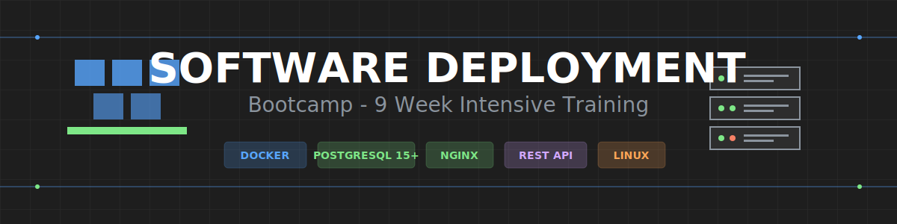

# Software Deployment Bootcamp



## 📋 Descripción General

Bootcamp intensivo de 9 semanas enfocado en la competencia de **Implantación de Software**, diseñado para capacitar a los participantes en la planificación y ejecución de actividades de implantación de software de acuerdo con las condiciones del sistema.

### Resultado de Aprendizaje

**Planear actividades de implantación del software de acuerdo con las condiciones del sistema**

---

## 🎯 Competencias Clave

- Preparar la plataforma tecnológica con base en el sistema operativo seleccionado
- Verificar el cumplimiento de características mínimas de hardware requeridas
- Diseñar planes de migración de datos según condiciones de implementación
- Diseñar planes de respaldo de datos para mitigar riesgos
- Elaborar planes de instalación según características del software

---

## 🗓️ Estructura del Programa

| Semana  | Tema                                 | Área de Enfoque                                                          |
| ------- | ------------------------------------ | ------------------------------------------------------------------------ |
| **1-2** | Hardware y Plataformas               | Hardware de servidores, requisitos mínimos, preparación de plataforma    |
| **3-4** | Sistemas Operativos de Servidor      | Linux Server, Windows Server, selección de SO                            |
| **5**   | Contenedores y Software de Servidor  | Docker, Docker Compose, PostgreSQL 15+, Nginx                            |
| **6**   | Hosting y Dominios                   | Tipos de hosting, gestión de dominios, FTP, CMS                          |
| **7**   | Migración y Respaldo de Datos        | Planes de migración, estrategias de backup, restauración                 |
| **8**   | Planificación de Instalación         | Elaboración de plan de instalación, verificación de requisitos           |
| **9**   | Integración y Proyecto Final         | Implantación completa de sistema, evaluación                             |

---

## 🛠️ Stack Tecnológico

- **Contenedores**: Docker & Docker Compose v2 _(sintaxis: `docker compose`)_
- **Base de Datos**: PostgreSQL 15+
- **Servidor Web**: Nginx
- **API**: Arquitectura REST
- **Sistemas Operativos**: Ubuntu Server, Rocky Linux
- **Control de Versiones**: Git con Conventional Commits

> **Nota**: Todo el código y nomenclatura técnica está en inglés. La documentación está en español.

---

## 🚀 Inicio Rápido

1. **Clonar el repositorio**

   ```bash
   git clone <repository-url>
   cd bc-implantacion
   ```

2. **Revisar documentación**

   - [Guía de Inicio Rápido](./_docs/QUICK-START.md)
   - [Instrucciones de Copilot](./.github/copilot-instructions.md)

3. **Configurar auto-commit (opcional)**
   ```bash
   ./scripts/install-cron.sh
   ```

---

## 📚 Documentación

- **[Guía de Inicio Rápido](./_docs/QUICK-START.md)** - Instalación y configuración
- **[Convención de Nomenclatura SVG](./_docs/CAMBIOS-NOMENCLATURA-SVG.md)** - Lineamientos de recursos gráficos
- **[Ejemplo de Código](./_docs/ejemplo-codigo-comentado.yml)** - Plantilla de código educativo
- **[Documentación de Scripts](./scripts/README.md)** - Scripts de automatización
- **[Instrucciones de Copilot](./.github/copilot-instructions.md)** - Lineamientos para desarrollo asistido por IA

---

## 📂 Estructura del Repositorio

```
bc-implantacion/
├── bootcamp/              # Contenido del bootcamp (9 semanas)
│   └── semana-XX/         # Contenido semanal
│       ├── 1-teoria/      # Material teórico
│       ├── 2-practicas/   # Ejercicios prácticos
│       ├── 3-recursos/    # Recursos complementarios
│       └── 4-asignación_dominios_aprendiz/  # Asignaciones
├── _docs/                 # Documentación detallada
├── scripts/               # Scripts de automatización
├── assets/                # Assets globales (banners, etc.)
└── secrets/               # Datos sensibles (en .gitignore)
```

---

## 🤝 Contribuciones

Este es un proyecto educativo. ¡Las contribuciones son bienvenidas! Por favor lee nuestras [Guías de Contribución](./CONTRIBUTING.md) y [Código de Conducta](./CODE_OF_CONDUCT.md).

---

## 📄 Licencia

Este proyecto está licenciado bajo la Licencia MIT - ver el archivo [LICENSE](./LICENSE) para más detalles.

---

## 👥 Autores y Reconocimientos

- **EPTI Development Team** - Trabajo inicial
- Ver [AUTHORS](./AUTHORS.md) para la lista completa de contribuidores

---

## 📞 Soporte

- **Issues**: [GitHub Issues](../../issues)
- **Documentación**: [_docs/](./_docs/)
- **Discusiones**: [GitHub Discussions](../../discussions)

---

Hecho con ❤️ para educación y código abierto

