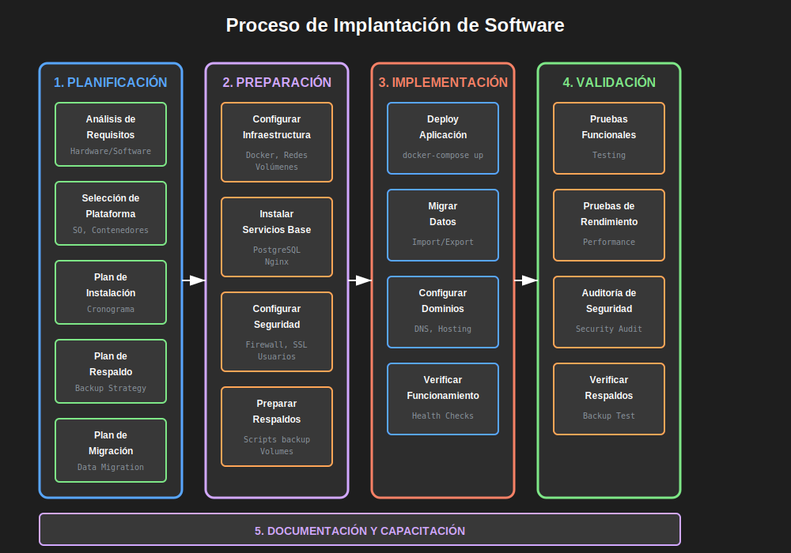

# Introducción a la Implantación de Software

## 🎯 Objetivo

Comprender qué es la implantación de software, por qué es crítica en el ciclo de vida del desarrollo, y cuáles son sus fases principales.

**Tiempo estimado**: 45 minutos

---

## 🤔 ¿Qué es Implantación de Software?

La **implantación de software** es el proceso mediante el cual un sistema de software es puesto en funcionamiento en un ambiente específico (desarrollo, pruebas, producción), asegurando que:

- ✅ El hardware cumple con los requisitos mínimos
- ✅ El sistema operativo está correctamente configurado
- ✅ Las dependencias están instaladas
- ✅ Los datos pueden ser migrados de sistemas anteriores
- ✅ El sistema está accesible para los usuarios finales
- ✅ Existe un plan de respaldo y recuperación

**¿Para qué?** La implantación correcta garantiza que el software funcione de manera óptima, segura y confiable en el ambiente destino.

---

## 📊 El Proceso de Implantación en 5 Fases



### Fase 1: Análisis y Planificación

**¿Qué hacemos?**

- Revisar requisitos de hardware y software
- Identificar el ambiente destino (on-premise, cloud, híbrido)
- Evaluar restricciones (presupuesto, tiempo, personal)
- Definir alcance de la implantación

**Artefactos generados**:

- Plan de implantación
- Matriz de requisitos de hardware
- Cronograma de actividades
- Análisis de riesgos

**Ejemplo real**: Una empresa que migra su ERP debe verificar si los servidores actuales soportan la nueva versión, o si requiere adquirir nuevo hardware.

---

### Fase 2: Preparación del Ambiente

**¿Qué hacemos?**

- Adquirir o configurar hardware
- Instalar sistema operativo
- Configurar redes y seguridad
- Instalar dependencias (bases de datos, servidores web)

**Tecnologías modernas**:

- **Contenedores Docker**: Permite preparar ambientes reproducibles
- **Infraestructura como Código**: Scripts que automatizan la configuración
- **Cloud Computing**: Ambientes en minutos (GCP, AWS, Azure)

**¿Para qué?** Un ambiente bien preparado evita el 80% de problemas en producción.

---

### Fase 3: Migración de Datos

**¿Qué hacemos?**

- Extraer datos del sistema anterior (Export)
- Transformar datos al nuevo formato (Transform)
- Cargar datos en el nuevo sistema (Load)
- Validar integridad de datos

**Proceso ETL (Extract, Transform, Load)**:

```
Sistema Antiguo → [Extracción] → Datos Crudos
      ↓
Datos Crudos → [Transformación] → Datos Limpios
      ↓
Datos Limpios → [Carga] → Nuevo Sistema
```

**Riesgos**:

- Pérdida de datos
- Corrupción de información
- Inconsistencias en relaciones

**Mitigación**: Siempre tener un **backup completo** antes de migrar.

---

### Fase 4: Instalación y Configuración

**¿Qué hacemos?**

- Desplegar la aplicación
- Configurar variables de ambiente
- Establecer conexiones a bases de datos
- Configurar certificados SSL
- Ajustar permisos de archivos

**Con Docker Compose**:

```yaml
# ¿Qué? Configuración completa de la aplicación
# ¿Para qué? Despliegue reproducible y consistente

services:
  app:
    image: mi-aplicacion:latest
    environment:
      # ¿Qué? Variables de configuración del ambiente
      DATABASE_URL: postgresql://user:pass@db:5432/mydb
      NODE_ENV: production
    ports:
      - '3000:3000' # ¿Para qué? Exponer puerto al host
    depends_on:
      - db # ¿Cómo? Garantiza que DB inicie primero

  db:
    image: postgres:15
    environment:
      POSTGRES_PASSWORD: supersecret
    volumes:
      - postgres_data:/var/lib/postgresql/data # ¿Para qué? Persistencia

volumes:
  postgres_data: # ¿Qué? Volumen para almacenamiento permanente
```

---

### Fase 5: Pruebas y Validación

**¿Qué hacemos?**

- Pruebas funcionales (¿Funciona como se espera?)
- Pruebas de rendimiento (¿Responde en tiempo aceptable?)
- Pruebas de seguridad (¿Hay vulnerabilidades?)
- Pruebas de integración (¿Se conecta correctamente con otros sistemas?)
- Pruebas de aceptación del usuario (UAT)

**Checklist de validación**:

- [ ] Todos los servicios están corriendo
- [ ] Base de datos es accesible
- [ ] Datos migrados correctamente
- [ ] Usuarios pueden autenticarse
- [ ] Funcionalidades críticas operan
- [ ] Logs no muestran errores críticos
- [ ] Backups automáticos funcionan
- [ ] Monitoreo está activo

**¿Para qué?** Detectar problemas **antes** de que los usuarios los encuentren.

---

## 🌍 Ambientes de Implantación

### 1. **Desarrollo (Development)**

- **Propósito**: Escribir y probar código nuevo
- **Características**:
  - Hardware modesto
  - Datos de prueba (no reales)
  - Logs verbose para debugging
- **Usuarios**: Solo desarrolladores

### 2. **Pruebas/QA (Testing/Quality Assurance)**

- **Propósito**: Validar funcionalidades antes de producción
- **Características**:
  - Similar a producción en configuración
  - Datos anonimizados o sintéticos
  - Acceso controlado
- **Usuarios**: Testers, QA team

### 3. **Staging (Pre-producción)**

- **Propósito**: Ensayo final antes de producción
- **Características**:
  - **Idéntico** a producción
  - Datos reales (con precauciones)
  - Último checkpoint antes de go-live
- **Usuarios**: Stakeholders, usuarios beta

### 4. **Producción (Production)**

- **Propósito**: Ambiente real donde operan usuarios finales
- **Características**:
  - Hardware robusto y redundante
  - Alta disponibilidad (99.9%+)
  - Monitoreo 24/7
  - Backups automáticos
- **Usuarios**: Todos los usuarios finales

---

## 🔄 Implantación Continua (CI/CD)

En el mundo moderno, la implantación no es un evento único, sino un **proceso continuo**:

```
Código → Build → Test → Deploy → Monitor → Repeat
```

**Herramientas**:

- **GitHub Actions**: Automatización de workflows
- **GitLab CI/CD**: Pipelines integrados
- **Jenkins**: Sistema de CI/CD open source
- **Docker**: Contenedores para despliegues consistentes

**Beneficios**:

- Deploys más frecuentes (varias veces al día)
- Menos errores humanos
- Rollback rápido si algo falla
- Feedback inmediato

---

## 📝 Caso de Estudio: Implantación de un E-commerce

**Contexto**: Una tienda física quiere lanzar su tienda online.

### Requisitos Identificados

| Categoría    | Requerimiento                                     |
| ------------ | ------------------------------------------------- |
| **Hardware** | Servidor con 16GB RAM, 4 cores CPU, 500GB SSD     |
| **Software** | Ubuntu Server 22.04, Docker, PostgreSQL 15, Nginx |
| **Red**      | IP pública, dominio registrado, certificado SSL   |
| **Datos**    | Migrar 50,000 productos desde Excel               |
| **Usuarios** | Capacidad para 1,000 usuarios simultáneos         |

### Plan de Implantación

**Semana 1**: Adquisición de servidor (GCP Compute Engine)  
**Semana 2**: Instalación de Ubuntu Server y Docker  
**Semana 3**: Configuración de PostgreSQL y migración de datos  
**Semana 4**: Despliegue de aplicación con Docker Compose  
**Semana 5**: Pruebas de carga y optimización  
**Semana 6**: Go-live y monitoreo

### Resultados

- ✅ Sistema online en 6 semanas
- ✅ Cero pérdida de datos
- ✅ Uptime del 99.8% en primer mes
- ✅ Tiempo de respuesta < 200ms

---

## ⚠️ Errores Comunes en Implantación

### Error #1: No verificar requisitos de hardware

**Consecuencia**: Aplicación lenta o que crashea constantemente.

**Solución**: Siempre hacer un **benchmark** antes de comprar hardware.

---

### Error #2: No tener plan de respaldo

**Consecuencia**: Pérdida catastrófica de datos si algo falla.

**Solución**: Implementar backups automáticos desde **día uno**.

---

### Error #3: No probar en ambiente de staging

**Consecuencia**: Bugs críticos descubiertos en producción por usuarios.

**Solución**: **Staging debe ser idéntico a producción**. Siempre probar ahí primero.

---

### Error #4: No documentar el proceso

**Consecuencia**: Imposible replicar la implantación o entrenar nuevo personal.

**Solución**: Documentar cada paso. Mejor aún: usar **Infrastructure as Code**.

---

### Error #5: Ignorar la seguridad

**Consecuencia**: Vulnerabilidades explotables, datos expuestos.

**Solución**:

- Usar HTTPS (certificado SSL)
- Firewall configurado
- Passwords seguros (nunca hardcodeados)
- Actualizaciones de seguridad automáticas

---

## 📖 Glosario Rápido

- **Deploy**: Poner el software en funcionamiento en un servidor
- **Rollback**: Revertir a una versión anterior del software
- **Downtime**: Tiempo en que el sistema no está disponible
- **High Availability (HA)**: Sistema diseñado para estar disponible 99.9%+ del tiempo
- **Backup**: Copia de seguridad de datos y configuraciones
- **Restore**: Proceso de recuperar datos desde un backup
- **Load Balancer**: Distribuye tráfico entre múltiples servidores
- **Uptime**: Porcentaje de tiempo que el sistema está operativo

---

## ✅ Autoevaluación

### Pregunta 1

¿Cuáles son las 5 fases del proceso de implantación?

<details>
<summary>Ver respuesta</summary>

1. Análisis y Planificación
2. Preparación del Ambiente
3. Migración de Datos
4. Instalación y Configuración
5. Pruebas y Validación

</details>

---

### Pregunta 2

¿Qué diferencia hay entre el ambiente de Staging y Producción?

<details>
<summary>Ver respuesta</summary>

**Staging** es un ambiente de pre-producción idéntico a producción pero usado para pruebas finales antes del lanzamiento. **Producción** es el ambiente real donde operan los usuarios finales. La clave es que Staging debe ser idéntico en configuración para detectar problemas antes de afectar a usuarios reales.

</details>

---

### Pregunta 3

¿Por qué es crítico tener un backup antes de una migración de datos?

<details>
<summary>Ver respuesta</summary>

Porque durante la migración pueden ocurrir errores que corrompan o pierdan datos. Un backup permite restaurar el estado anterior si algo sale mal, evitando pérdida catastrófica de información.

</details>

---

### Pregunta 4

¿Qué ventajas tiene usar Docker para implantación?

<details>
<summary>Ver respuesta</summary>

- Ambientes reproducibles (funciona igual en cualquier máquina)
- Aislamiento de dependencias
- Despliegues más rápidos
- Fácil escalamiento
- Portabilidad entre servidores y clouds
- Rollback sencillo a versiones anteriores

</details>

---

### Pregunta 5

Menciona 3 artefactos que se generan en la fase de "Análisis y Planificación"

<details>
<summary>Ver respuesta</summary>

1. Plan de implantación (documento maestro)
2. Matriz de requisitos de hardware
3. Cronograma de actividades
4. Análisis de riesgos (también válido)

</details>

---

## 🔗 Referencias

- [The Twelve-Factor App](https://12factor.net/) - Metodología para aplicaciones modernas
- [Docker Documentation](https://docs.docker.com/)
- [SFIA Framework - Software Deployment](https://sfia-online.org/en/sfia-8/skills/software-deployment)

---

## 📌 Próximos Pasos

En la siguiente sección aprenderás sobre **Hardware de Servidores**: tipos, características y especificaciones mínimas según el ambiente.

**Continuar a**: [02-hardware-servidores.md](./02-hardware-servidores.md)
