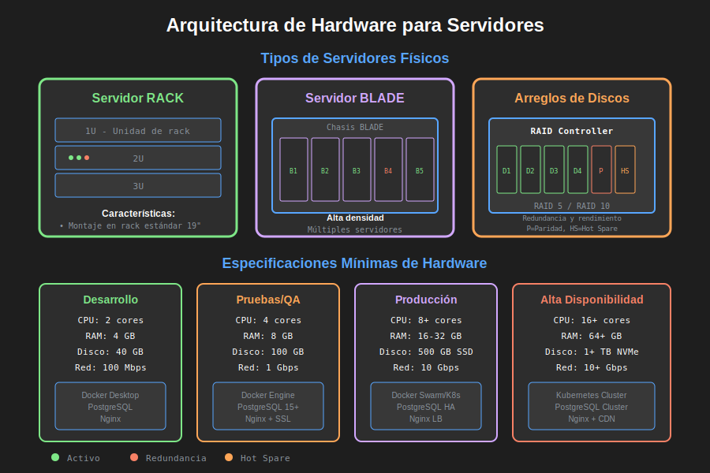

# Hardware de Servidores

## 🎯 Objetivo

Conocer los tipos de hardware utilizados en servidores, sus características, y cómo determinar las especificaciones mínimas según el ambiente y tipo de aplicación.

**Tiempo estimado**: 45 minutos

---

## 🖥️ ¿Qué es un Servidor?

Un **servidor** es una computadora diseñada para:

- Operar 24/7 sin interrupción
- Procesar múltiples peticiones simultáneas
- Soportar cargas de trabajo intensivas
- Ofrecer alta confiabilidad y redundancia

**Diferencia clave con una PC de escritorio**:

| Característica     | PC Escritorio     | Servidor                           |
| ------------------ | ----------------- | ---------------------------------- |
| **Uptime**         | 8-12 horas/día    | 24/7/365                           |
| **Usuarios**       | 1 usuario         | Cientos o miles                    |
| **RAM**            | 8-32 GB           | 64-512 GB+                         |
| **Almacenamiento** | 1 disco           | Múltiples discos (RAID)            |
| **Redundancia**    | No                | Sí (fuentes, ventiladores, discos) |
| **CPU**            | Consumer (i5, i7) | Server (Xeon, EPYC)                |
| **Costo**          | $500-2000         | $3,000-50,000+                     |

---

## 📦 Tipos de Servidores por Factor de Forma



### 1. Servidor TOWER (Torre)

**¿Qué es?**  
Servidor con formato de torre, similar a una PC de escritorio pero más grande y robusto.

**Características**:

- ✅ Fácil de mantener (acceso a componentes)
- ✅ No requiere rack
- ✅ Económico para pequeñas empresas
- ❌ Ocupa más espacio
- ❌ Difícil de escalar

**Especificaciones típicas**:

```
CPU: Intel Xeon E-2400 (4-8 cores)
RAM: 32-64 GB ECC
Almacenamiento: 2-4 discos SATA (hasta 8TB c/u)
Redundancia: Fuente de poder redundante (opcional)
Precio: $2,000 - $5,000
```

**¿Para qué se usa?**

- Pequeñas oficinas
- Servidor de archivos
- Controlador de dominio (Active Directory)
- Servidor de desarrollo

**Ejemplo real**: Una clínica con 20 empleados necesita un servidor para su sistema de citas. Un Tower es ideal: económico, suficiente capacidad, fácil de mantener.

---

### 2. Servidor RACK

**¿Qué es?**  
Servidor diseñado para montarse en un rack estándar de 19 pulgadas. Se miden en **"U"** (unidades de rack):

- **1U** = 1.75 pulgadas (4.45 cm) de altura
- Servidores vienen en 1U, 2U, 4U

**Características**:

- ✅ Diseño compacto (ahorro de espacio)
- ✅ Fácil escalabilidad (apilar múltiples servidores)
- ✅ Cableado organizado
- ✅ Refrigeración centralizada
- ❌ Requiere rack (costo adicional)
- ❌ Más ruidosos

**Especificaciones típicas (2U)**:

```
CPU: Dual Intel Xeon Silver 4310 (12 cores c/u = 24 cores)
RAM: 128-256 GB ECC DDR4
Almacenamiento: 8-12 discos SAS/SSD en RAID 10
Redundancia: Fuentes de poder duales, ventiladores redundantes
Red: 4 puertos Gigabit o 10Gb
Precio: $8,000 - $20,000
```

**¿Para qué se usa?**

- Datacenters empresariales
- Servidores web de alto tráfico
- Bases de datos de producción
- Virtualización (VMware, Proxmox)

**Ejemplo real**: Un e-commerce que espera 10,000 usuarios simultáneos necesita servidores rack para soportar la carga y poder escalar agregando más unidades al rack.

---

### 3. Servidor BLADE

**¿Qué es?**  
"Cuchillas" (blades) de servidor que se insertan en un **chasis compartido**. El chasis provee:

- Fuentes de poder compartidas
- Ventiladores compartidos
- Switches de red integrados
- Backplane de conexión

**Características**:

- ✅ Máxima densidad (16+ blades en 10U)
- ✅ Eficiencia energética
- ✅ Cableado mínimo
- ✅ Gestión centralizada
- ❌ Muy costoso (inversión inicial alta)
- ❌ Vendor lock-in (HP, Dell, Cisco)

**Especificaciones típicas**:

```
Chasis: Soporta 8-16 blades
Por Blade:
  CPU: Dual Intel Xeon Gold (20 cores c/u)
  RAM: 256-512 GB
  Almacenamiento: SSD locales + SAN externo
Red: 10/25/40 Gbps integrada
Precio: $40,000 - $150,000 (chasis completo)
```

**¿Para qué se usa?**

- Grandes datacenters
- Cloud providers (AWS, GCP, Azure)
- Empresas con cientos de servidores
- High Performance Computing (HPC)

**Ejemplo real**: Un banco con operaciones globales necesita miles de máquinas virtuales. Los blade servers permiten concentrar esa capacidad en poco espacio físico.

---

## 💾 Arreglos de Discos (RAID)

**RAID** = **R**edundant **A**rray of **I**ndependent **D**isks  
**¿Para qué?** Combinar múltiples discos para aumentar rendimiento y/o redundancia.

### RAID 0 - Striping (Sin Redundancia)

**¿Cómo funciona?**  
Los datos se dividen entre 2+ discos.

```
Archivo de 100MB con 2 discos:
Disco 1: 50MB
Disco 2: 50MB
```

**Características**:

- ✅ Velocidad: Doble lectura/escritura
- ✅ Capacidad: 100% (2x 1TB = 2TB)
- ❌ **Sin redundancia**: Si 1 disco falla, pierdes TODO

**Uso**: Edición de video, scratch disks (datos temporales)

---

### RAID 1 - Mirroring (Espejo)

**¿Cómo funciona?**  
Los datos se duplican en 2+ discos.

```
Archivo de 100MB:
Disco 1: 100MB (copia A)
Disco 2: 100MB (copia B)
```

**Características**:

- ✅ Redundancia: Si 1 disco falla, tienes backup
- ✅ Lectura rápida (lee de ambos discos)
- ❌ Capacidad: 50% (2x 1TB = 1TB útil)
- ❌ Escritura igual de lenta

**Uso**: Sistema operativo de servidores, datos críticos

---

### RAID 5 - Striping con Paridad

**¿Cómo funciona?**  
Datos + paridad distribuida en 3+ discos.

```
Mínimo 3 discos:
Disco 1: Data Block A
Disco 2: Data Block B
Disco 3: Paridad (A XOR B)
```

**Características**:

- ✅ Buen balance rendimiento/redundancia
- ✅ Capacidad: (N-1) discos útiles (3x 1TB = 2TB útil)
- ✅ Tolera 1 disco fallido
- ❌ Escritura más lenta (cálculo de paridad)

**Uso**: Servidores de archivos, bases de datos medianas

---

### RAID 10 (1+0) - Mirror + Stripe

**¿Cómo funciona?**  
Combina RAID 1 (espejo) + RAID 0 (striping). Mínimo 4 discos.

```
Discos 1+2: Mirror (Grupo A)
Discos 3+4: Mirror (Grupo B)
Grupos A+B: Striping
```

**Características**:

- ✅ Excelente rendimiento
- ✅ Alta redundancia (tolera hasta 2 discos si son de mirrors diferentes)
- ❌ Capacidad: 50% (4x 1TB = 2TB útil)
- ❌ Costoso (requiere más discos)

**Uso**: Bases de datos de producción, aplicaciones críticas

---

## 📊 Comparación de RAID

| RAID   | Discos Mín. | Capacidad Útil | Redundancia | Rendimiento      | Uso Recomendado       |
| ------ | ----------- | -------------- | ----------- | ---------------- | --------------------- |
| **0**  | 2           | 100%           | ❌ Ninguna  | ⚡⚡⚡ Excelente | Scratch, temporal     |
| **1**  | 2           | 50%            | ✅ 1 disco  | ⚡⚡ Bueno       | SO, datos críticos    |
| **5**  | 3           | (N-1)/N        | ✅ 1 disco  | ⚡⚡ Bueno       | Archivos, DB pequeñas |
| **10** | 4           | 50%            | ✅ 2 discos | ⚡⚡⚡ Excelente | DB producción         |

---

## 🔧 Componentes Críticos de un Servidor

### 1. CPU (Procesador)

**CPUs para servidores**:

- **Intel Xeon** (E, Silver, Gold, Platinum)
- **AMD EPYC** (mejor relación precio/rendimiento)

**Características clave**:

- Múltiples cores (8-64+ cores por CPU)
- Soporte para múltiples CPUs (dual, quad socket)
- ECC memory support (detección de errores)
- Mayor cache L3 (para manejar múltiples procesos)

**¿Cómo elegir?**

```
Aplicación Web ligera → 4-8 cores
Base de datos mediana → 12-24 cores
Machine Learning → 32-64+ cores
```

---

### 2. RAM (Memoria)

**Tipos**:

- **ECC RAM**: Error-Correcting Code (detecta y corrige errores)
  - **¿Para qué?** Evitar corrupción de datos en operaciones críticas
  - **¿Cómo?** Bits de paridad extra validan integridad
- **Registered (RDIMM)**: Para grandes capacidades (128GB+)

**¿Cuánta RAM necesito?**

| Tipo de Aplicación          | RAM Recomendada |
| --------------------------- | --------------- |
| Servidor web (Nginx/Apache) | 4-8 GB          |
| API REST (Node.js)          | 8-16 GB         |
| Base de datos pequeña       | 16-32 GB        |
| Base de datos mediana       | 64-128 GB       |
| Base de datos grande        | 256-512 GB+     |
| Virtualización (10 VMs)     | 128-256 GB      |
| Machine Learning            | 256 GB - 1 TB+  |

**Regla general**:

```
RAM mínima = (Datos activos × 2) + (Procesos simultáneos × 2GB)
```

---

### 3. Almacenamiento

**Tipos de discos**:

#### HDD (Hard Disk Drive)

- **Tecnología**: Discos magnéticos giratorios
- **Velocidad**: 7,200 - 15,000 RPM
- **Capacidad**: 1-20 TB
- **Costo**: $20-40 por TB
- **Uso**: Backups, archivos, data warehouse

#### SSD (Solid State Drive)

- **Tecnología**: Memoria flash (sin partes móviles)
- **Velocidad**: 10x más rápido que HDD
- **Capacidad**: 256GB - 8TB
- **Costo**: $80-120 por TB
- **Uso**: Sistema operativo, bases de datos, aplicaciones

#### NVMe (Non-Volatile Memory Express)

- **Tecnología**: SSD con interfaz PCIe (no SATA)
- **Velocidad**: 5-7x más rápido que SSD SATA
- **Capacidad**: 500GB - 4TB
- **Costo**: $100-150 por TB
- **Uso**: Bases de datos de alto rendimiento, analytics

**Comparación de velocidades**:

```
HDD:     150 MB/s lectura
SSD:     550 MB/s lectura
NVMe:  3,500 MB/s lectura
```

---

### 4. Red (Network)

**Velocidades comunes**:

- **1 Gbps** (Gigabit Ethernet): Estándar actual
- **10 Gbps**: Para servidores de bases de datos
- **25/40 Gbps**: Datacenters modernos
- **100 Gbps**: Backbone de cloud providers

**¿Cuándo necesito 10 Gbps?**

- Bases de datos con alta concurrencia
- Servidores de archivos corporativos
- Streaming de video
- Transferencias masivas de datos

---

### 5. Fuentes de Poder Redundantes

**¿Qué es?**  
Dos fuentes de poder independientes. Si una falla, la otra mantiene el servidor operando.

**¿Para qué?**  
Evitar downtime por fallas eléctricas.

```
Fuente A: 750W → ACTIVA
Fuente B: 750W → STANDBY

Si Fuente A falla:
Fuente B toma el control en milisegundos (sin apagar el servidor)
```

**¿Cómo se conecta?**  
Idealmente cada fuente a un circuito eléctrico diferente (o a UPS diferentes).

---

## 📋 Especificaciones Mínimas por Ambiente

### Ambiente de Desarrollo

**Propósito**: Escribir código, probar funcionalidades básicas

```yaml
# ¿Qué? Especificaciones para ambiente de desarrollo
# ¿Para qué? Ejecutar la aplicación localmente sin retrasos

CPU: 4 cores (equivalente a i5/Ryzen 5)
RAM: 16 GB
Almacenamiento: 256 GB SSD
Red: 1 Gbps
Redundancia: No requerida
Sistema Operativo: Ubuntu Desktop / Windows 10
Costo aproximado: $800 - $1,200
```

**Ejemplo con Docker**:  
Un laptop con estas specs puede correr cómodamente:

- PostgreSQL en contenedor
- API REST (Node.js/Python)
- Frontend (React/Vue)
- Todo simultáneamente

---

### Ambiente de Pruebas (QA)

**Propósito**: Validar funcionalidades, ejecutar test suites

```yaml
# ¿Qué? Especificaciones para ambiente de pruebas
# ¿Para qué? Simular carga de múltiples usuarios simultáneos

CPU: 8 cores
RAM: 32 GB
Almacenamiento: 500 GB SSD (RAID 1 recomendado)
Red: 1 Gbps
Redundancia: Recomendada para discos
Sistema Operativo: Ubuntu Server 22.04
Costo aproximado: $2,500 - $4,000
```

---

### Ambiente de Staging (Pre-producción)

**Propósito**: Réplica exacta de producción para validación final

**⚠️ Regla de oro**: Staging DEBE ser idéntico a producción en especificaciones.

```yaml
# ¿Qué? Especificaciones para staging
# ¿Para qué? Validar rendimiento real antes de go-live

[Mismas specs que producción]
```

Si producción tiene:

- 16 cores → Staging tiene 16 cores
- 128 GB RAM → Staging tiene 128 GB RAM
- RAID 10 → Staging tiene RAID 10

**¿Por qué?**  
Para detectar problemas de rendimiento que solo aparecen bajo carga real.

---

### Ambiente de Producción

**Propósito**: Servir a usuarios finales

```yaml
# ¿Qué? Especificaciones para producción (ejemplo: e-commerce mediano)
# ¿Para qué? Soportar 1,000-5,000 usuarios simultáneos

CPU: 16-24 cores (Dual Xeon Silver o AMD EPYC)
RAM: 128-256 GB ECC
Almacenamiento:
  - SO: 2x 500GB SSD en RAID 1
  - Datos: 4x 2TB NVMe en RAID 10
Red: 10 Gbps
Redundancia:
  - Fuentes de poder duales
  - Ventiladores redundantes
  - Discos en RAID
Sistema Operativo: Ubuntu Server 22.04 LTS
Backup: Diario automático a storage externo
Costo aproximado: $15,000 - $30,000
```

---

## 🧮 Cálculo de Requisitos de Hardware

### Método 1: Por Usuarios Simultáneos

**Fórmula básica**:

```
RAM (GB) = (Usuarios simultáneos / 50) × 4 GB
CPU (cores) = (Usuarios simultáneos / 100) × 2 cores
```

**Ejemplo**:  
Sistema con 1,000 usuarios simultáneos:

```
RAM = (1000 / 50) × 4 = 80 GB → Redondear a 128 GB
CPU = (1000 / 100) × 2 = 20 cores → Elegir 24 cores
```

---

### Método 2: Por Tipo de Workload

**Fórmula por workload**:

#### Web Server (Nginx, Apache)

```
RAM = 2 GB base + (1 GB × cada 100 req/seg)
CPU = 4 cores base + (2 cores × cada 500 req/seg)
```

#### Database Server (PostgreSQL, MySQL)

```
RAM = Tamaño DB × 2 (mínimo)
CPU = 8 cores base + (4 cores × cada 1000 transactions/seg)
Almacenamiento = Tamaño DB × 3 (para crecimiento + backups)
```

#### API REST (Node.js, Python)

```
RAM = 4 GB base + (2 GB × cada 1000 req/seg)
CPU = 4 cores base + (4 cores × cada 2000 req/seg)
```

---

### Método 3: Benchmarking

**Proceso**:

1. Instalar la aplicación en un servidor de prueba
2. Generar carga sintética (herramientas como Apache JMeter, k6)
3. Monitorear uso de recursos (CPU, RAM, disco, red)
4. Calcular con margen de seguridad del 30-50%

**Ejemplo**:  
Prueba con 500 usuarios:

- CPU: 60% de uso en 8 cores
- RAM: 45 GB usados
- Disco: 200 IOPS

Para soportar 2,000 usuarios:

```
CPU: (8 cores × 4) × 1.3 = 42 cores → 48 cores
RAM: (45 GB × 4) × 1.3 = 234 GB → 256 GB
Disco: (200 IOPS × 4) × 1.3 = 1040 IOPS → SSD en RAID 10
```

---

## ☁️ Alternativa: Cloud Computing

En lugar de comprar hardware físico, usar máquinas virtuales en la nube:

### Google Cloud Platform (GCP) - Recomendado

**Always Free Tier** (sin costo, permanente):

```
VM: e2-micro instance
  - CPU: 2 vCPUs (shared)
  - RAM: 1 GB
  - Disco: 30 GB standard
  - Tráfico: 1 GB/mes egress (salida)

Ideal para:
  - Ambiente de desarrollo personal
  - Bots y scripts automatizados
  - Sitios web de bajo tráfico
```

**Free Trial** ($300 créditos por 90 días):

```
Puedes crear instancias más grandes:
  - n2-standard-4: 4 vCPUs, 16 GB RAM
  - n2-standard-8: 8 vCPUs, 32 GB RAM
  - Con SSD persistente de hasta 1 TB
```

**Cálculo de costos** (después del free trial):

```
n2-standard-4 (4 vCPUs, 16 GB):
  $146/mes en us-central1
  $0.20/hora

n2-standard-8 (8 vCPUs, 32 GB):
  $291/mes en us-central1
  $0.40/hora
```

**Ventajas**:

- ✅ No comprar hardware
- ✅ Escalar en minutos
- ✅ Pagar solo por uso
- ✅ Backups automáticos
- ✅ Alta disponibilidad

**Desventajas**:

- ❌ Costos recurrentes
- ❌ Dependencia de internet
- ❌ Vendor lock-in

Ver [GCP-SETUP.md](../../../_docs/GCP-SETUP.md) para guía completa de configuración.

---

## 📝 Caso Práctico: Sistema de Reservas

**Contexto**: Un hotel con 100 habitaciones necesita un sistema de reservas online.

### Análisis de Requisitos

**Usuarios esperados**:

- Concurrentes: 50-100 usuarios simultáneos (temporada alta)
- Pico: 200 usuarios (eventos especiales)

**Datos**:

- Reservas: ~10,000/año
- Clientes: ~5,000 registros
- Habitaciones: 100 registros
- Tamaño DB estimado: 5 GB

**Servicios necesarios**:

- Frontend (React)
- API REST (Node.js)
- Base de datos (PostgreSQL)
- Servidor web (Nginx)

### Cálculo de Hardware

**Opción 1: Servidor Físico (on-premise)**

```yaml
# ¿Qué? Servidor para 100 usuarios concurrentes
# ¿Para qué? Hosting interno, control total

Tipo: Tower o Rack 1U
CPU: Intel Xeon E-2388G (8 cores, 3.2 GHz)
RAM: 64 GB ECC
Almacenamiento:
  - 2x 500 GB SSD en RAID 1 (SO + aplicación)
  - 2x 2 TB HDD en RAID 1 (backups)
Red: 1 Gbps
Redundancia: Fuente dual (recomendada)
Costo: $6,000 - $8,000
```

**Opción 2: Cloud (GCP)**

```yaml
# ¿Qué? VM en Google Cloud Platform
# ¿Para qué? Flexibilidad y escalabilidad

Instancia: n2-standard-4
  CPU: 4 vCPUs
  RAM: 16 GB
Disco: 100 GB SSD persistente
Región: us-east1
Costo: ~$150/mes ($1,800/año)
```

### Recomendación

**Para el hotel**: Empezar con GCP (n2-standard-4)

**¿Por qué?**

- ✅ Inversión inicial baja ($0 vs $8,000)
- ✅ Escalabilidad (si crece, aumentar CPU/RAM en minutos)
- ✅ No preocuparse por mantenimiento de hardware
- ✅ Backups automáticos incluidos

Después de 4 años:

- Costo acumulado: $7,200
- Si el negocio va bien, considerar servidor físico para largo plazo

---

## ✅ Autoevaluación

### Pregunta 1

¿Cuál es la principal diferencia entre un servidor RACK y un servidor BLADE?

<details>
<summary>Ver respuesta</summary>

Los servidores **RACK** son unidades independientes que se montan en un rack estándar de 19", cada uno con su propia fuente de poder y ventiladores.

Los servidores **BLADE** son "cuchillas" que se insertan en un chasis compartido, donde comparten fuentes de poder, ventiladores y switches de red. Los BLADE ofrecen mayor densidad (más servidores en menos espacio) pero tienen mayor costo inicial.

</details>

---

### Pregunta 2

¿Qué RAID recomendarías para una base de datos de producción crítica y por qué?

<details>
<summary>Ver respuesta</summary>

**RAID 10** (1+0).

**Razones**:

- Excelente rendimiento (striping)
- Alta redundancia (mirroring)
- Tolera hasta 2 discos fallidos (si son de mirrors diferentes)
- Ideal para I/O intensivo de bases de datos

RAID 5 sería segunda opción si el presupuesto es limitado.

</details>

---

### Pregunta 3

Un sistema espera 500 usuarios simultáneos. Calcula RAM y CPU necesarios usando el método de usuarios.

<details>
<summary>Ver respuesta</summary>

Usando las fórmulas:

```
RAM = (500 / 50) × 4 GB = 40 GB → Redondear a 64 GB
CPU = (500 / 100) × 2 cores = 10 cores → Elegir 12 cores
```

Recomendación final:

- **CPU**: 12-16 cores
- **RAM**: 64 GB (con posibilidad de expandir a 128 GB)

</details>

---

### Pregunta 4

¿Cuándo tiene sentido usar Cloud en lugar de hardware físico?

<details>
<summary>Ver respuesta</summary>

**Usar Cloud cuando**:

- Startup o proyecto nuevo (baja inversión inicial)
- Carga variable (escalar según demanda)
- Crecimiento rápido esperado
- No hay infraestructura existente
- Necesidad de múltiples regiones geográficas

**Usar hardware físico cuando**:

- Carga estable y predecible a largo plazo
- Restricciones de compliance (datos sensibles)
- Ya existe datacenter propio
- Cálculo de ROI favorable después de 3-4 años

</details>

---

### Pregunta 5

¿Qué es ECC RAM y por qué es importante en servidores?

<details>
<summary>Ver respuesta</summary>

**ECC RAM** = Error-Correcting Code Memory

**¿Qué es?** Memoria con bits de paridad extra que detectan y corrigen errores de 1 bit.

**¿Por qué es importante?**

- Evita corrupción de datos en operaciones críticas
- Aumenta confiabilidad en servidores 24/7
- Esencial para bases de datos y transacciones financieras

Un error no corregido en RAM puede corromper registros en una base de datos, causando pérdidas millonarias.

</details>

---

## 🔗 Referencias

- [Intel Xeon Processors](https://www.intel.com/content/www/us/en/products/details/processors/xeon.html)
- [AMD EPYC Processors](https://www.amd.com/en/processors/epyc-server-cpu-family)
- [Understanding RAID](https://www.prepressure.com/library/technology/raid)
- [GCP Pricing Calculator](https://cloud.google.com/products/calculator)

---

## 📌 Próximos Pasos

En la siguiente sección aprenderás sobre **Contenedores y Docker**: la tecnología que revolucionó la implantación de software.

**Continuar a**: [03-introduccion-docker.md](./03-introduccion-docker.md)
