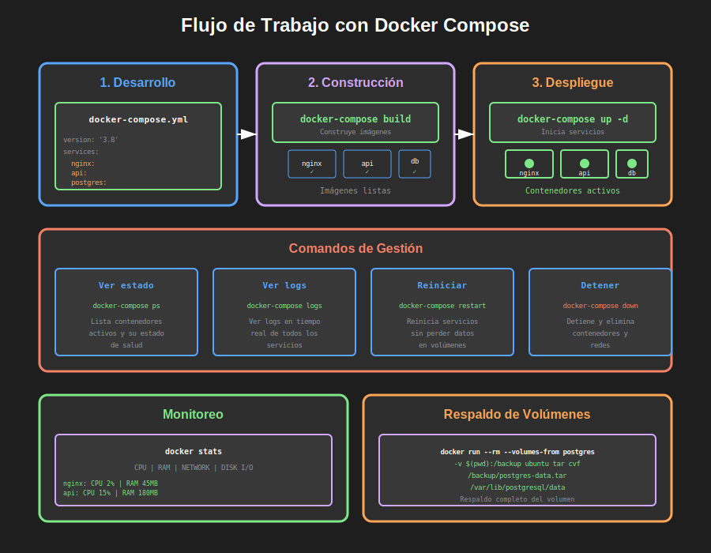

# Introducción a Docker y Contenedores

## 🎯 Objetivo

Comprender qué son los contenedores, cómo Docker revolucionó la implantación de software, y los conceptos fundamentales para trabajar con contenedores.

**Tiempo estimado**: 45 minutos

---

## 🐋 ¿Qué es Docker?

**Docker** es una plataforma para desarrollar, distribuir y ejecutar aplicaciones en **contenedores**.

**Definición simple**:  
Un contenedor es como una "caja" que empaqueta tu aplicación con todo lo que necesita para funcionar (código, librerías, dependencias), garantizando que se ejecute igual en cualquier máquina.

**Analogía del mundo real**:  
Imagina enviar un paquete por correo:

- **Sin contenedores**: Envías piezas sueltas que el destinatario debe ensamblar (puede fallar)
- **Con contenedores**: Envías un paquete completo y listo para usar (siempre funciona)


---

## 🆚 Contenedores vs Máquinas Virtuales

### Máquinas Virtuales (VMs)

```
┌─────────────────────────────────────┐
│      Aplicación 1 + App 2          │
├─────────────────────────────────────┤
│     Sistema Operativo Completo     │ ← 2-4 GB
│         (Ubuntu, Windows)           │
├─────────────────────────────────────┤
│         Hypervisor (VMware)        │
├─────────────────────────────────────┤
│    Sistema Operativo Host (SO)     │
├─────────────────────────────────────┤
│           Hardware Físico           │
└─────────────────────────────────────┘
```

**Características**:

- ✅ Aislamiento completo
- ✅ Pueden ejecutar diferentes sistemas operativos
- ❌ Pesadas (GB de espacio)
- ❌ Lentas para iniciar (minutos)
- ❌ Consumen muchos recursos

---

### Contenedores Docker

```
┌─────────────────────────────────────┐
│  App 1  │  App 2  │  App 3  │ App 4 │ ← Solo las apps
├─────────────────────────────────────┤
│          Docker Engine              │ ← Gestiona contenedores
├─────────────────────────────────────┤
│    Sistema Operativo Host (SO)      │ ← Compartido
├─────────────────────────────────────┤
│           Hardware Físico            │
└─────────────────────────────────────┘
```

**Características**:

- ✅ Ligeros (MB de espacio)
- ✅ Rápidos para iniciar (segundos)
- ✅ Eficientes en recursos
- ✅ Portables (funcionan igual en cualquier lado)
- ❌ Comparten el kernel del SO host

---

## 📊 Comparación Directa

| Característica          | Máquina Virtual  | Contenedor Docker              |
| ----------------------- | ---------------- | ------------------------------ |
| **Tamaño**              | 2-10 GB          | 50-500 MB                      |
| **Inicio**              | 1-5 minutos      | 1-5 segundos                   |
| **Aislamiento**         | Completo         | Proceso-nivel                  |
| **Performance**         | Overhead ~10-30% | Overhead ~2-5%                 |
| **Portabilidad**        | Limitada         | Excelente                      |
| **Uso de Recursos**     | Alto             | Bajo                           |
| **Sistemas Operativos** | Múltiples SO     | Solo Linux containers en Linux |

---

## 🧩 Conceptos Fundamentales

### 1. Imagen (Image)

**¿Qué es?**  
Una plantilla de solo lectura que contiene todo lo necesario para ejecutar una aplicación.

**Analogía**: Una imagen es como una **receta de cocina** o un **plano arquitectónico**.

**Componentes de una imagen**:

- Sistema operativo base (Ubuntu, Alpine Linux)
- Código de la aplicación
- Dependencias (librerías, frameworks)
- Configuraciones
- Comandos de inicio

**Ejemplo**: `postgres:15`

```
Esta imagen contiene:
- Alpine Linux (sistema base)
- PostgreSQL 15 instalado
- Scripts de inicialización
- Configuraciones por defecto
```

**¿Dónde se almacenan?**  
En **Docker Hub** (registro público) o registros privados.

---

### 2. Contenedor (Container)

**¿Qué es?**  
Una instancia en ejecución de una imagen.

**Analogía**: Si la imagen es una **receta**, el contenedor es el **plato preparado**.

**Características**:

- Estado en ejecución (running, stopped, paused)
- Efímero (se puede crear y destruir fácilmente)
- Aislado de otros contenedores
- Tiene su propio filesystem, red, procesos

**Ejemplo**:

```bash
# ¿Qué? Crear un contenedor desde la imagen postgres:15
# ¿Para qué? Ejecutar una base de datos PostgreSQL
docker run --name mi-postgres -e POSTGRES_PASSWORD=mipassword postgres:15

# Ahora tienes:
# Imagen: postgres:15 (plantilla)
# Contenedor: mi-postgres (instancia corriendo)
```

**Múltiples contenedores de la misma imagen**:

```bash
# ¿Qué? Crear 3 contenedores independientes
# ¿Para qué? Separar ambientes (dev, test, staging)

docker run --name postgres-dev -e POSTGRES_PASSWORD=dev postgres:15
docker run --name postgres-test -e POSTGRES_PASSWORD=test postgres:15
docker run --name postgres-staging -e POSTGRES_PASSWORD=staging postgres:15

# 1 imagen → 3 contenedores independientes
```

---

### 3. Dockerfile

**¿Qué es?**  
Un archivo de texto con instrucciones para construir una imagen personalizada.

**Analogía**: Es como escribir tu propia **receta** en lugar de usar una predefinida.

**Ejemplo básico**:

```dockerfile
# ¿Qué? Imagen base de Node.js versión 20
# ¿Para qué? Ejecutar aplicaciones JavaScript en el servidor
FROM node:20-alpine

# ¿Qué? Establece el directorio de trabajo dentro del contenedor
# ¿Para qué? Organizar los archivos de la aplicación
WORKDIR /app

# ¿Qué? Copia package.json y package-lock.json
# ¿Para qué? Instalar dependencias antes de copiar código (optimización de cache)
COPY package*.json ./

# ¿Qué? Instala las dependencias del proyecto
# ¿Para qué? Preparar el ambiente de ejecución
RUN npm install --production

# ¿Qué? Copia el resto del código de la aplicación
# ¿Para qué? Incluir toda la aplicación en la imagen
COPY . .

# ¿Qué? Expone el puerto 3000
# ¿Para qué? Documentar qué puerto usa la aplicación (no abre el puerto)
EXPOSE 3000

# ¿Qué? Comando por defecto al iniciar el contenedor
# ¿Para qué? Ejecutar el servidor Node.js
CMD ["node", "server.js"]
```

**Construir la imagen**:

```bash
# ¿Qué? Construye una imagen desde el Dockerfile
# ¿Para qué? Crear una imagen personalizada con nuestra app
# ¿Cómo? Lee el Dockerfile y ejecuta cada instrucción en capas
docker build -t mi-app:1.0 .
```

---

### 4. Docker Hub

**¿Qué es?**  
Un registro público de imágenes Docker (como GitHub pero para imágenes).

**¿Para qué?**

- Descargar imágenes oficiales (PostgreSQL, Nginx, Redis)
- Compartir tus propias imágenes
- Colaboración en equipo

**Imágenes oficiales más populares**:

- `nginx` - Servidor web
- `postgres` - Base de datos PostgreSQL
- `mysql` - Base de datos MySQL
- `redis` - Base de datos en memoria
- `node` - Runtime de Node.js
- `python` - Intérprete de Python
- `ubuntu` - Sistema operativo Ubuntu

**Descargar imagen**:

```bash
# ¿Qué? Descarga la imagen oficial de Nginx
# ¿Para qué? Tener la imagen localmente para crear contenedores
docker pull nginx:latest
```

---

### 5. Volúmenes (Volumes)

**¿Qué es?**  
Mecanismo para persistir datos generados por contenedores.

**¿Por qué son necesarios?**  
Los contenedores son **efímeros**: si destruyes el contenedor, pierdes todos los datos dentro.

**Problema sin volúmenes**:

```bash
# ¿Qué? Crear contenedor de PostgreSQL
docker run --name db postgres:15

# Insertas 1000 registros en la base de datos...

# ¿Qué? Eliminas el contenedor
docker rm -f db

# ❌ ¡Perdiste los 1000 registros!
```

**Solución con volúmenes**:

```bash
# ¿Qué? Crear contenedor con volumen para persistencia
# ¿Para qué? Guardar datos fuera del contenedor
# ¿Cómo? El volumen "postgres_data" se mapea a la carpeta de datos de PostgreSQL
docker run --name db \
  -v postgres_data:/var/lib/postgresql/data \
  postgres:15

# Insertas 1000 registros...

# ¿Qué? Eliminas el contenedor
docker rm -f db

# ¿Qué? Creas un nuevo contenedor con el mismo volumen
docker run --name db-nuevo \
  -v postgres_data:/var/lib/postgresql/data \
  postgres:15

# ✅ ¡Los 1000 registros siguen ahí!
```

**Tipos de volúmenes**:

1. **Named volumes** (recomendado):

```bash
docker run -v mi_volumen:/data postgres:15
```

2. **Bind mounts** (mapear carpeta del host):

```bash
docker run -v /home/user/data:/data postgres:15
```

3. **Tmpfs mounts** (en memoria, no persiste):

```bash
docker run --tmpfs /tmp postgres:15
```

---

### 6. Redes (Networks)

**¿Qué es?**  
Mecanismo para que contenedores se comuniquen entre sí.


**Por defecto**: Cada contenedor tiene su propia red aislada.

**Problema sin redes**:

```bash
# Contenedor 1: API REST
docker run --name api mi-api:1.0

# Contenedor 2: PostgreSQL
docker run --name db postgres:15

# ❌ La API no puede conectarse a la base de datos
```

**Solución con redes**:

```bash
# ¿Qué? Crear una red personalizada
# ¿Para qué? Permitir comunicación entre contenedores
docker network create mi-red

# ¿Qué? Conectar ambos contenedores a la misma red
docker run --name db --network mi-red postgres:15
docker run --name api --network mi-red mi-api:1.0

# ✅ Ahora la API puede conectarse a "db:5432"
```

**Tipos de redes**:

1. **bridge** (por defecto): Red privada en el host
2. **host**: Usa la red del host directamente
3. **overlay**: Para comunicar contenedores en diferentes hosts
4. **none**: Sin red

---

## 🏗️ Docker Compose

**¿Qué es?**  
Herramienta para definir y ejecutar aplicaciones multi-contenedor usando un archivo YAML.

**¿Para qué?**  
En lugar de ejecutar múltiples comandos `docker run`, defines todo en un archivo y lo ejecutas con un comando.



**Ejemplo sin Docker Compose** (tedioso):

```bash
# Crear red
docker network create mi-app-net

# Crear volumen
docker volume create postgres_data

# Ejecutar PostgreSQL
docker run -d --name db \
  --network mi-app-net \
  -v postgres_data:/var/lib/postgresql/data \
  -e POSTGRES_PASSWORD=secret \
  postgres:15

# Ejecutar API
docker run -d --name api \
  --network mi-app-net \
  -e DATABASE_URL=postgresql://postgres:secret@db:5432/mydb \
  -p 3000:3000 \
  mi-api:1.0

# Ejecutar Nginx
docker run -d --name web \
  --network mi-app-net \
  -p 80:80 \
  nginx:latest
```

**Ejemplo con Docker Compose** (elegante):

```yaml
# ¿Qué? Archivo docker-compose.yml
# ¿Para qué? Definir toda la aplicación multi-contenedor

# IMPORTANTE: Usar sintaxis de Docker Compose v2
# Versión instalada: Docker Compose v2.39.4+

services:
  # ¿Qué? Servicio de base de datos
  db:
    image: postgres:15
    environment:
      POSTGRES_PASSWORD: secret
    volumes:
      - postgres_data:/var/lib/postgresql/data
    # ¿Qué? Nombre de red automático: <nombre_proyecto>_default

  # ¿Qué? Servicio de API REST
  api:
    image: mi-api:1.0
    environment:
      DATABASE_URL: postgresql://postgres:secret@db:5432/mydb
    ports:
      - '3000:3000'
    depends_on:
      - db # ¿Para qué? Garantiza que db inicie antes que api

  # ¿Qué? Servicio de servidor web
  web:
    image: nginx:latest
    ports:
      - '80:80'
    depends_on:
      - api

volumes:
  postgres_data: # ¿Qué? Define el volumen nombrado
```

**Ejecutar todo**:

```bash
# ¿Qué? Inicia todos los servicios definidos
# ¿Para qué? Levantar toda la aplicación con un comando
# ¿Cómo? Crea redes, volúmenes y contenedores automáticamente
docker compose up -d

# -d = detached mode (segundo plano)
```

**Ver estado**:

```bash
# ¿Qué? Muestra el estado de los servicios
docker compose ps
```

**Ver logs**:

```bash
# ¿Qué? Muestra logs de todos los servicios
docker compose logs -f

# Solo de un servicio:
docker compose logs -f api
```

**Detener todo**:

```bash
# ¿Qué? Detiene y elimina contenedores, redes
# ¿Para qué? Limpiar el ambiente (volúmenes persisten)
docker compose down
```

---

## 🎨 Ventajas de Docker en Implantación

### 1. **Portabilidad Total**

**Problema tradicional**:

```
Desarrollador: "Funciona en mi máquina" 🤷
Producción: Crash 💥
```

**Con Docker**:

```bash
# Lo mismo en todas partes:
docker compose up

# Funciona en:
- ✅ Tu laptop (Windows/Mac/Linux)
- ✅ Servidor de pruebas (Ubuntu)
- ✅ Servidor de producción (Rocky Linux)
- ✅ GCP / AWS / Azure
```

---

### 2. **Ambientes Reproducibles**

**Sin Docker**: "Necesitas instalar Node.js 20, PostgreSQL 15, Redis 7, configurar..."

**Con Docker**:

```yaml
services:
  app:
    image: node:20
  db:
    image: postgres:15
  cache:
    image: redis:7
```

Listo. Cualquier desarrollador hace `docker compose up` y tiene el ambiente completo.

---

### 3. **Aislamiento de Dependencias**

**Problema**: Dos proyectos requieren diferentes versiones de Python.

**Sin Docker**:

```bash
# Proyecto A necesita Python 3.9
# Proyecto B necesita Python 3.11
# 😖 Conflicto!
```

**Con Docker**:

```bash
# Proyecto A
docker run -v ./proyecto-a:/app python:3.9 python app.py

# Proyecto B
docker run -v ./proyecto-b:/app python:3.11 python app.py

# ✅ Sin conflicto, cada uno en su contenedor
```

---

### 4. **Despliegue Rápido**

**Proceso tradicional**:

1. Instalar sistema operativo (30 min)
2. Instalar dependencias (45 min)
3. Configurar servicios (1 hora)
4. Debugging de configuraciones (2 horas)
5. **Total: ~4-5 horas**

**Proceso con Docker**:

```bash
git clone https://github.com/mi-empresa/mi-app.git
cd mi-app
docker compose up -d
# ✅ Total: 5 minutos
```

---

### 5. **Escalabilidad Horizontal**

**Escalar servicios**:

```bash
# ¿Qué? Escalar el servicio "api" a 5 instancias
# ¿Para qué? Manejar más carga distribuyendo el trabajo
docker compose up -d --scale api=5

# Ahora tienes:
# - 1 contenedor de PostgreSQL
# - 5 contenedores de API (balanceo de carga)
# - 1 contenedor de Nginx
```

---

### 6. **Rollback Fácil**

**Algo salió mal en producción**:

```bash
# ¿Qué? Revertir a la versión anterior
# ¿Para qué? Recuperar estabilidad inmediatamente
docker compose down
docker compose pull mi-app:1.4  # versión anterior
docker compose up -d

# ✅ Rollback en 30 segundos
```

---

## 🚀 Flujo de Trabajo con Docker

### Desarrollo → Producción

```
1. DESARROLLO (Tu Laptop)
   └── Escribes código
   └── Pruebas en contenedor local
   └── docker compose up

2. COMMIT & PUSH
   └── git push origin main

3. CI/CD (GitHub Actions)
   └── Ejecuta tests automáticos
   └── Construye imagen Docker
   └── Publica a Docker Hub / Registry

4. STAGING (Servidor de pruebas)
   └── docker compose pull
   └── docker compose up -d
   └── Validación final

5. PRODUCCIÓN (Servidor real)
   └── docker compose pull
   └── docker compose up -d
   └── Monitoreo
```

**¿Para qué este flujo?**  
Garantiza que el código que funciona en tu laptop funcione **exactamente igual** en producción.

---

## 📦 Ejemplo Completo: Sistema de Blog

**Arquitectura**:

- Frontend: React (puerto 3000)
- API: Node.js + Express (puerto 4000)
- Base de datos: PostgreSQL (puerto 5432)
- Caché: Redis (puerto 6379)
- Proxy: Nginx (puerto 80)

**docker-compose.yml**:

```yaml
# ¿Qué? Definición completa de un blog con 5 servicios
# ¿Para qué? Desplegar todo el stack con un comando

# Sintaxis: Docker Compose v2 (no v1)

services:
  # ¿Qué? Base de datos PostgreSQL
  db:
    image: postgres:15
    environment:
      POSTGRES_DB: blogdb
      POSTGRES_USER: bloguser
      POSTGRES_PASSWORD: ${DB_PASSWORD} # ¿Cómo? Lee de archivo .env
    volumes:
      - postgres_data:/var/lib/postgresql/data
    healthcheck: # ¿Para qué? Verificar que el servicio está listo
      test: ['CMD-SHELL', 'pg_isready -U bloguser']
      interval: 10s
      timeout: 5s
      retries: 5

  # ¿Qué? Caché Redis
  cache:
    image: redis:7-alpine
    command: redis-server --appendonly yes
    volumes:
      - redis_data:/data

  # ¿Qué? API Backend
  api:
    image: mi-blog-api:1.0
    environment:
      DATABASE_URL: postgresql://bloguser:${DB_PASSWORD}@db:5432/blogdb
      REDIS_URL: redis://cache:6379
      NODE_ENV: production
    ports:
      - '4000:4000'
    depends_on:
      db:
        condition: service_healthy # ¿Para qué? Espera a que DB esté lista
      cache:
        condition: service_started

  # ¿Qué? Frontend React
  frontend:
    image: mi-blog-frontend:1.0
    environment:
      REACT_APP_API_URL: http://api:4000
    depends_on:
      - api

  # ¿Qué? Nginx como reverse proxy
  nginx:
    image: nginx:latest
    ports:
      - '80:80'
      - '443:443'
    volumes:
      - ./nginx.conf:/etc/nginx/nginx.conf:ro
      - ./certs:/etc/nginx/certs:ro
    depends_on:
      - frontend
      - api

volumes:
  postgres_data: # ¿Qué? Persistencia de base de datos
  redis_data: # ¿Qué? Persistencia de caché
```

**Archivo .env**:

```bash
# ¿Qué? Variables de ambiente sensibles
# ¿Para qué? No exponer passwords en código
DB_PASSWORD=supersecret123
```

**Levantar todo**:

```bash
# ¿Qué? Inicia los 5 servicios
# ¿Cómo? Crea volúmenes, redes, y contenedores en orden correcto
docker compose up -d

# Ver logs en tiempo real:
docker compose logs -f

# Ver estado:
docker compose ps
```

**Resultado**:

- `http://localhost` → Frontend React
- `http://localhost/api` → API REST
- PostgreSQL corriendo en puerto 5432 (solo accesible internamente)
- Redis corriendo en puerto 6379 (solo accesible internamente)

---

## ⚠️ Mejores Prácticas

### 1. **Usar .dockerignore**

**¿Para qué?** Evitar copiar archivos innecesarios a la imagen.

```
# .dockerignore
node_modules/
.git/
.env
*.log
Dockerfile
docker-compose.yml
```

---

### 2. **Imágenes Ligeras**

**Mal**:

```dockerfile
FROM ubuntu:22.04  # 77 MB base
RUN apt-get update && apt-get install -y python3
```

**Bien**:

```dockerfile
FROM python:3.11-alpine  # 17 MB base
```

**Diferencia**: 77 MB vs 17 MB → 4.5x más ligera

---

### 3. **Nunca Hardcodear Secrets**

**Mal**:

```yaml
environment:
  POSTGRES_PASSWORD: mysecretpassword # ❌ Expuesto en código
```

**Bien**:

```yaml
environment:
  POSTGRES_PASSWORD: ${DB_PASSWORD} # ✅ Lee de .env
```

---

### 4. **Usar Health Checks**

**¿Para qué?** Verificar que el servicio está realmente listo (no solo iniciado).

```yaml
services:
  db:
    image: postgres:15
    healthcheck:
      test: ['CMD-SHELL', 'pg_isready -U postgres']
      interval: 10s
      timeout: 5s
      retries: 5
```

---

### 5. **Limpiar Recursos No Usados**

```bash
# ¿Qué? Elimina imágenes, contenedores, volúmenes y redes no usados
# ¿Para qué? Liberar espacio en disco
docker system prune -a --volumes
```

---

## ✅ Autoevaluación

### Pregunta 1

¿Cuál es la diferencia fundamental entre una imagen y un contenedor?

<details>
<summary>Ver respuesta</summary>

Una **imagen** es una plantilla de solo lectura (como una receta o plano) que contiene el código, dependencias y configuraciones.

Un **contenedor** es una instancia en ejecución de una imagen (como el plato preparado o el edificio construido).

Puedes crear múltiples contenedores desde la misma imagen.

</details>

---

### Pregunta 2

¿Por qué los volúmenes son importantes en Docker?

<details>
<summary>Ver respuesta</summary>

Los contenedores son **efímeros**: cuando se eliminan, se pierden todos los datos internos.

Los **volúmenes** permiten persistir datos fuera del contenedor, en el host o en almacenamiento remoto. Esto es crítico para bases de datos, logs, y cualquier dato que deba sobrevivir al ciclo de vida del contenedor.

</details>

---

### Pregunta 3

¿Qué ventajas tiene Docker Compose sobre ejecutar comandos `docker run` individuales?

<details>
<summary>Ver respuesta</summary>

**Docker Compose**:

- ✅ Define toda la aplicación en un archivo YAML
- ✅ Un comando para levantar todo (`docker compose up`)
- ✅ Gestiona automáticamente redes y volúmenes
- ✅ Orden de inicio con `depends_on`
- ✅ Fácil de versionar (archivo en git)
- ✅ Simplifica despliegues

vs múltiples comandos `docker run` largos y propensos a errores.

</details>

---

### Pregunta 4

¿Docker Compose v1 o v2? ¿Cuál es la diferencia en comandos?

<details>
<summary>Ver respuesta</summary>

**Docker Compose v1** (deprecated):

```bash
docker-compose up  # con guion
```

**Docker Compose v2** (actual, recomendado):

```bash
docker compose up  # sin guion, integrado en Docker CLI
```

La sintaxis v2 está integrada en Docker CLI y es más rápida. Siempre usar v2 en proyectos nuevos.

</details>

---

### Pregunta 5

Menciona 3 ventajas de usar Docker para implantación.

<details>
<summary>Ver respuesta</summary>

1. **Portabilidad**: Funciona igual en desarrollo, pruebas y producción
2. **Reproducibilidad**: Ambientes idénticos garantizados
3. **Despliegue rápido**: Minutos en lugar de horas
4. **Aislamiento**: Dependencias no entran en conflicto (también válido)
5. **Escalabilidad**: Fácil escalar horizontalmente (también válido)

</details>

---

## 🔗 Referencias

- [Docker Documentation](https://docs.docker.com/)
- [Docker Compose v2 Docs](https://docs.docker.com/compose/)
- [Docker Hub](https://hub.docker.com/)
- [Dockerfile Best Practices](https://docs.docker.com/develop/develop-images/dockerfile_best-practices/)

---

## 📌 Próximos Pasos

Ahora que entiendes los conceptos, en la sección de **Prácticas** instalarás Docker y crearás tus primeros contenedores.

**Continuar a**: [../2-practicas/01-instalar-docker.md](../2-practicas/01-instalar-docker.md)
