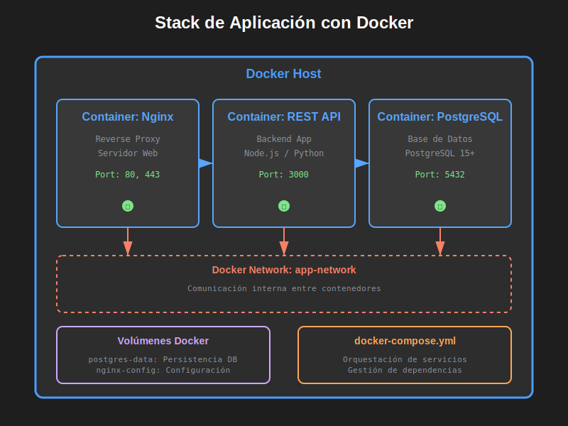
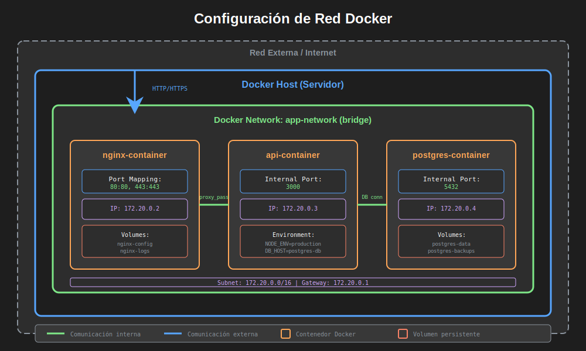

# Introducción a Docker y Contenedores (Parte 1: Fundamentos)

## 🎯 Objetivo

Comprender qué son los contenedores, por qué Docker es importante para implantación de software, y los conceptos básicos para comenzar a trabajar con Docker.

**Tiempo estimado**: 30 minutos (lectura + discusión)

> ℹ️ **Nota**: Esta es la Parte 1 (fundamentos). En Semana 2 veremos Docker Compose, arquitectura avanzada y mejores prácticas.

---

## 🐋 ¿Qué es Docker?

**Docker** es una plataforma para desarrollar, distribuir y ejecutar aplicaciones en **contenedores**.

**Definición simple**:  
Un contenedor es como una "caja" que empaqueta tu aplicación con todo lo que necesita para funcionar (código, librerías, dependencias), garantizando que se ejecute igual en cualquier máquina.

**Analogía del mundo real**:  
Imagina enviar un paquete por correo:

- **Sin contenedores**: Envías piezas sueltas que el destinatario debe ensamblar (puede fallar)
- **Con contenedores**: Envías un paquete completo y listo para usar (siempre funciona)



---

## 🆚 Contenedores vs Máquinas Virtuales

### Máquinas Virtuales (VMs)

```
┌─────────────────────────────────────┐
│      Aplicación 1 + App 2          │
├─────────────────────────────────────┤
│     Sistema Operativo Completo     │ ← 2-4 GB
│         (Ubuntu, Windows)           │
├─────────────────────────────────────┤
│         Hypervisor (VMware)        │
├─────────────────────────────────────┤
│    Sistema Operativo Host (SO)     │
├─────────────────────────────────────┤
│           Hardware Físico           │
└─────────────────────────────────────┘
```

**Características**:

- ✅ Aislamiento completo
- ✅ Pueden ejecutar diferentes sistemas operativos
- ❌ Pesadas (GB de espacio)
- ❌ Lentas para iniciar (minutos)
- ❌ Consumen muchos recursos

---

### Contenedores Docker

```
┌─────────────────────────────────────┐
│  App 1  │  App 2  │  App 3  │ App 4 │ ← Solo las apps
├─────────────────────────────────────┤
│          Docker Engine              │ ← Gestiona contenedores
├─────────────────────────────────────┤
│    Sistema Operativo Host (SO)      │ ← Compartido
├─────────────────────────────────────┤
│           Hardware Físico            │
└─────────────────────────────────────┘
```

**Características**:

- ✅ Ligeros (MB de espacio)
- ✅ Rápidos para iniciar (segundos)
- ✅ Eficientes en recursos
- ✅ Portables (funcionan igual en cualquier lado)
- ❌ Comparten el kernel del SO host

---

## 📊 Comparación Directa

| Característica          | Máquina Virtual  | Contenedor Docker              |
| ----------------------- | ---------------- | ------------------------------ |
| **Tamaño**              | 2-10 GB          | 50-500 MB                      |
| **Inicio**              | 1-5 minutos      | 1-5 segundos                   |
| **Aislamiento**         | Completo         | Proceso-nivel                  |
| **Performance**         | Overhead ~10-30% | Overhead ~2-5%                 |
| **Portabilidad**        | Limitada         | Excelente                      |
| **Uso de Recursos**     | Alto             | Bajo                           |
| **Sistemas Operativos** | Múltiples SO     | Solo Linux containers en Linux |

---

## 🧩 Conceptos Fundamentales

### 1. Imagen (Image)

**¿Qué es?**  
Una plantilla de solo lectura que contiene todo lo necesario para ejecutar una aplicación.

**Analogía**: Una imagen es como una **receta de cocina** o un **plano arquitectónico**.

**Componentes de una imagen**:

- Sistema operativo base (Ubuntu, Alpine Linux)
- Código de la aplicación
- Dependencias (librerías, frameworks)
- Configuraciones
- Comandos de inicio

**Ejemplo**: `postgres:15`

```
Esta imagen contiene:
- Alpine Linux (sistema base)
- PostgreSQL 15 instalado
- Scripts de inicialización
- Configuraciones por defecto
```

**¿Dónde se almacenan?**  
En **Docker Hub** (registro público) o registros privados.

---

### 2. Contenedor (Container)

**¿Qué es?**  
Una instancia en ejecución de una imagen.

**Analogía**: Si la imagen es una **receta**, el contenedor es el **plato preparado**.

**Características**:

- Estado en ejecución (running, stopped, paused)
- Efímero (se puede crear y destruir fácilmente)
- Aislado de otros contenedores
- Tiene su propio filesystem, red, procesos

**Ejemplo**:

```bash
# ¿Qué? Crear un contenedor desde la imagen postgres:15
# ¿Para qué? Ejecutar una base de datos PostgreSQL
docker run --name mi-postgres -e POSTGRES_PASSWORD=mipassword postgres:15

# Ahora tienes:
# Imagen: postgres:15 (plantilla)
# Contenedor: mi-postgres (instancia corriendo)
```

**Múltiples contenedores de la misma imagen**:

```bash
# ¿Qué? Crear 3 contenedores independientes
# ¿Para qué? Separar ambientes (dev, test, staging)

docker run --name postgres-dev -e POSTGRES_PASSWORD=dev postgres:15
docker run --name postgres-test -e POSTGRES_PASSWORD=test postgres:15
docker run --name postgres-staging -e POSTGRES_PASSWORD=staging postgres:15

# 1 imagen → 3 contenedores independientes
```

---

### 3. Dockerfile

**¿Qué es?**  
Un archivo de texto con instrucciones para construir una imagen personalizada.

**Analogía**: Es como escribir tu propia **receta** en lugar de usar una predefinida.

**Ejemplo básico**:

```dockerfile
# ¿Qué? Imagen base de Node.js versión 20
# ¿Para qué? Ejecutar aplicaciones JavaScript en el servidor
FROM node:20-alpine

# ¿Qué? Establece el directorio de trabajo dentro del contenedor
# ¿Para qué? Organizar los archivos de la aplicación
WORKDIR /app

# ¿Qué? Copia package.json y package-lock.json
# ¿Para qué? Instalar dependencias antes de copiar código (optimización de cache)
COPY package*.json ./

# ¿Qué? Instala las dependencias del proyecto
# ¿Para qué? Preparar el ambiente de ejecución
RUN npm install --production

# ¿Qué? Copia el resto del código de la aplicación
# ¿Para qué? Incluir toda la aplicación en la imagen
COPY . .

# ¿Qué? Expone el puerto 3000
# ¿Para qué? Documentar qué puerto usa la aplicación (no abre el puerto)
EXPOSE 3000

# ¿Qué? Comando por defecto al iniciar el contenedor
# ¿Para qué? Ejecutar el servidor Node.js
CMD ["node", "server.js"]
```

**Construir la imagen**:

```bash
# ¿Qué? Construye una imagen desde el Dockerfile
# ¿Para qué? Crear una imagen personalizada con nuestra app
# ¿Cómo? Lee el Dockerfile y ejecuta cada instrucción en capas
docker build -t mi-app:1.0 .
```

---

### 4. Docker Hub

**¿Qué es?**  
Un registro público de imágenes Docker (como GitHub pero para imágenes).

**¿Para qué?**

- Descargar imágenes oficiales (PostgreSQL, Nginx, Redis)
- Compartir tus propias imágenes
- Colaboración en equipo

**Imágenes oficiales más populares**:

- `nginx` - Servidor web
- `postgres` - Base de datos PostgreSQL
- `mysql` - Base de datos MySQL
- `redis` - Base de datos en memoria
- `node` - Runtime de Node.js
- `python` - Intérprete de Python
- `ubuntu` - Sistema operativo Ubuntu

**Descargar imagen**:

```bash
# ¿Qué? Descarga la imagen oficial de Nginx
# ¿Para qué? Tener la imagen localmente para crear contenedores
docker pull nginx:latest
```

---

### 5. Volúmenes (Volumes)

**¿Qué es?**  
Mecanismo para persistir datos generados por contenedores.

**¿Por qué son necesarios?**  
Los contenedores son **efímeros**: si destruyes el contenedor, pierdes todos los datos dentro.

**Problema sin volúmenes**:

```bash
# ¿Qué? Crear contenedor de PostgreSQL
docker run --name db postgres:15

# Insertas 1000 registros en la base de datos...

# ¿Qué? Eliminas el contenedor
docker rm -f db

# ❌ ¡Perdiste los 1000 registros!
```

**Solución con volúmenes**:

```bash
# ¿Qué? Crear contenedor con volumen para persistencia
# ¿Para qué? Guardar datos fuera del contenedor
# ¿Cómo? El volumen "postgres_data" se mapea a la carpeta de datos de PostgreSQL
docker run --name db \
  -v postgres_data:/var/lib/postgresql/data \
  postgres:15

# Insertas 1000 registros...

# ¿Qué? Eliminas el contenedor
docker rm -f db

# ¿Qué? Creas un nuevo contenedor con el mismo volumen
docker run --name db-nuevo \
  -v postgres_data:/var/lib/postgresql/data \
  postgres:15

# ✅ ¡Los 1000 registros siguen ahí!
```

**Tipos de volúmenes**:

1. **Named volumes** (recomendado):

```bash
docker run -v mi_volumen:/data postgres:15
```

2. **Bind mounts** (mapear carpeta del host):

```bash
docker run -v /home/user/data:/data postgres:15
```

3. **Tmpfs mounts** (en memoria, no persiste):

```bash
docker run --tmpfs /tmp postgres:15
```

---

### 6. Redes (Networks)

**¿Qué es?**  
Mecanismo para que contenedores se comuniquen entre sí.



**Por defecto**: Cada contenedor tiene su propia red aislada.

**Problema sin redes**:

```bash
# Contenedor 1: API REST
docker run --name api mi-api:1.0

# Contenedor 2: PostgreSQL
docker run --name db postgres:15

# ❌ La API no puede conectarse a la base de datos
```

**Solución con redes**:

```bash
# ¿Qué? Crear una red personalizada
# ¿Para qué? Permitir comunicación entre contenedores
docker network create mi-red

# ¿Qué? Conectar ambos contenedores a la misma red
docker run --name db --network mi-red postgres:15
docker run --name api --network mi-red mi-api:1.0

# ✅ Ahora la API puede conectarse a "db:5432"
```

**Tipos de redes**:

1. **bridge** (por defecto): Red privada en el host
2. **host**: Usa la red del host directamente
3. **overlay**: Para comunicar contenedores en diferentes hosts
4. **none**: Sin red

---

## 🏗️ ¿Qué veremos en Semana 2?

En la siguiente sesión profundizaremos en:

- **Docker Compose**: Gestión de aplicaciones multi-contenedor
- **Arquitectura interna de Docker**: Cómo funciona bajo el capó
- **Docker en producción**: Mejores prácticas y seguridad
- **Orquestación**: Introducción a Kubernetes (conceptos)

---

## ✅ Autoevaluación

### Pregunta 1

¿Cuál es la diferencia fundamental entre una imagen y un contenedor?

<details>
<summary>Ver respuesta</summary>

Una **imagen** es una plantilla de solo lectura (como una receta o plano) que contiene el código, dependencias y configuraciones.

Un **contenedor** es una instancia en ejecución de una imagen (como el plato preparado o el edificio construido).

Puedes crear múltiples contenedores desde la misma imagen.

</details>

---

### Pregunta 2

¿Por qué los volúmenes son importantes en Docker?

<details>
<summary>Ver respuesta</summary>

Los contenedores son **efímeros**: cuando se eliminan, se pierden todos los datos internos.

Los **volúmenes** permiten persistir datos fuera del contenedor, en el host o en almacenamiento remoto. Esto es crítico para bases de datos, logs, y cualquier dato que deba sobrevivir al ciclo de vida del contenedor.

</details>

---

### Pregunta 3

¿Qué ventajas tiene Docker Compose sobre ejecutar comandos `docker run` individuales?

<details>
<summary>Ver respuesta</summary>

**Docker Compose**:

- ✅ Define toda la aplicación en un archivo YAML
- ✅ Un comando para levantar todo (`docker compose up`)
- ✅ Gestiona automáticamente redes y volúmenes
- ✅ Orden de inicio con `depends_on`
- ✅ Fácil de versionar (archivo en git)
- ✅ Simplifica despliegues

vs múltiples comandos `docker run` largos y propensos a errores.

</details>

---

### Pregunta 4

¿Para qué necesitamos volúmenes en Docker?

<details>
<summary>Ver respuesta</summary>

Los contenedores son **efímeros**: cuando se eliminan, se pierden todos los datos internos.

Los **volúmenes** permiten persistir datos fuera del contenedor, esto es crítico para bases de datos, logs, y cualquier dato que deba sobrevivir al ciclo de vida del contenedor.

</details>

---

### Pregunta 5

Menciona 2 ventajas de usar Docker para implantación.

<details>
<summary>Ver respuesta</summary>

1. **Portabilidad**: Funciona igual en desarrollo, pruebas y producción
2. **Despliegue rápido**: Minutos en lugar de horas
3. **Aislamiento**: Dependencias no entran en conflicto (también válido)

</details>

---

## 🔗 Referencias

- [Docker Documentation](https://docs.docker.com/)
- [Docker Compose v2 Docs](https://docs.docker.com/compose/)
- [Docker Hub](https://hub.docker.com/)
- [Dockerfile Best Practices](https://docs.docker.com/develop/develop-images/dockerfile_best-practices/)

---

## 📌 Próximos Pasos

Ahora que entiendes los conceptos, en la sección de **Prácticas** instalarás Docker y crearás tus primeros contenedores.

**Continuar a**: [../2-practicas/01-instalar-docker.md](../2-practicas/01-instalar-docker.md)
